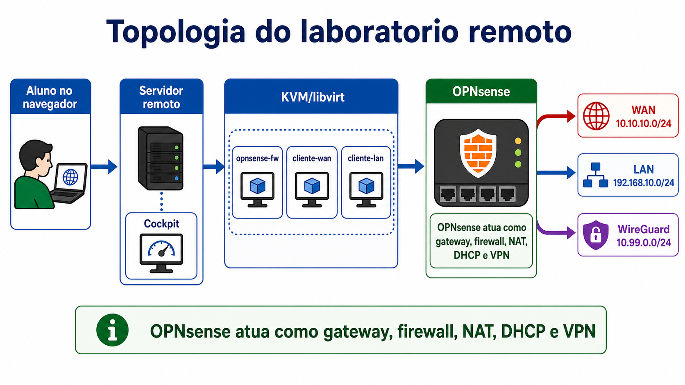

# Firewall e Roteamento Avançado com OPNsense

Laboratório acadêmico de Sistemas Operacionais para demonstrar, em ambiente
local e reproduzível, conceitos de firewall, roteamento, NAT, DNAT, serviços de
LAN e VPN com WireGuard usando OPNsense.

O projeto usa KVM/libvirt para executar três máquinas virtuais e um dashboard
web em FastAPI para validar a topologia durante a apresentação.



## Objetivos

- Simular uma rede com firewall entre WAN, LAN e VPN.
- Demonstrar gateway, DHCP, DNS, NAT de saída e DNAT.
- Validar bloqueios de firewall entre redes.
- Demonstrar acesso controlado à LAN por WireGuard.
- Entregar um roteiro executável de validação para apresentação acadêmica.

## Escopo Acadêmico

Este repositório foi organizado como material de entrega e reprodução do
experimento. Ele contém:

- documentação da topologia e dos conceitos demonstrados;
- scripts de preparação do host Linux;
- importação automatizada das VMs no KVM/libvirt;
- provisionamento local dos clientes;
- dashboard de validação com testes controlados;
- guias de diagnóstico para erros comuns de ambiente.

## Topologia

| VM | Função |
| --- | --- |
| `opnsense-fw` | Firewall, gateway, DHCP, DNS, NAT, DNAT e WireGuard |
| `cliente-lan` | Cliente interno da LAN e servidor HTTP temporário |
| `cliente-wan` | Cliente externo e peer WireGuard |

| Rede | Endereço | Uso |
| --- | --- | --- |
| WAN | `10.10.10.0/24` | Rede externa simulada |
| LAN | `192.168.10.0/24` | Rede interna protegida |
| WireGuard | `10.99.0.0/24` | Túnel VPN |

Endereços principais:

| Host | Endereço |
| --- | --- |
| OPNsense LAN | `192.168.10.1` |
| OPNsense WAN | `10.10.10.146` |
| Cliente LAN | `192.168.10.100` |
| Cliente WAN | `10.10.10.171` |
| OPNsense WireGuard | `10.99.0.1` |
| Cliente WireGuard | `10.99.0.2` |

## Estrutura do Repositório

| Caminho | Conteúdo |
| --- | --- |
| `app/` | Dashboard FastAPI usado na validação |
| `infra/` | Scripts de instalação, diagnóstico, importação e provisionamento |
| `infra/vm-config/` | Definições libvirt das VMs e redes |
| `docs/` | Topologia, roteiro, arquivos externos e solução de problemas |
| `assets/` | Imagens e logos usados na documentação/apresentação |
| `presentation/` | Apresentação final exportada em PDF |
| `COMO_RODAR.md` | Guia curto para executar o laboratório |
| `INSTALACAO.md` | Guia de instalação detalhado |

## Requisitos

- Linux com virtualização habilitada na BIOS/UEFI.
- KVM/QEMU e libvirt.
- Docker com Compose para o dashboard, ou Python 3 para modo nativo.
- Cockpit opcional para gerenciar as VMs pelo navegador.
- Aproximadamente 6 GB de RAM livres.
- Aproximadamente 15 GB de disco livres.
- Arquivos das VMs em `local/vm-images/`.

O script `infra/install-prereqs.sh` instala os pacotes equivalentes usando o
gerenciador disponível no sistema (`apt`, `dnf`, `pacman` ou `zypper`).

## Execução Rápida

1. Instale as dependências:

```bash
sudo bash infra/install-prereqs.sh
```

Depois faça logout/login para os grupos `libvirt`, `kvm` e `docker` valerem.

2. Coloque os arquivos de VM em `local/vm-images/`:

```text
opnsense-fw-installed.qcow2
cliente-lan.qcow2
cliente-wan.qcow2
noble-server-cloudimg-amd64.img
cliente-lan.iso
cliente-wan.iso
```

3. Valide o host e suba o laboratório:

```bash
bash infra/check-host.sh
bash infra/setup.sh
```

4. Acesse:

```text
Dashboard: http://localhost:8088
OPNsense:  https://192.168.10.1  (root / opnsense)
Cockpit:   http://localhost:9090
```

O guia curto está em [COMO_RODAR.md](COMO_RODAR.md). O guia completo está em
[INSTALACAO.md](INSTALACAO.md).

## Validações do Dashboard

O dashboard executa sete validações fixas, sem terminal livre, para reduzir erro
durante a apresentação.

Ele valida:

- status das três VMs;
- LAN, DNS, NAT de saída e HTTPS externo para `www.google.com`;
- bloqueio de acesso direto da WAN para a LAN e da porta WAN `80`;
- subida do servidor HTTP temporário no cliente LAN;
- publicação controlada com DNAT na porta `8080`;
- limpeza do servidor HTTP temporário;
- WireGuard e acesso à LAN via VPN.

Detalhes do roteiro estão em [docs/roteiro-validacao.md](docs/roteiro-validacao.md).

## Metodologia de Validação

A validação foi dividida em camadas:

1. host: comandos, grupos, KVM, libvirt, Docker e arquivos de imagem;
2. infraestrutura: redes virtuais, discos importados e VMs em execução;
3. provisionamento: chave SSH local, IP fixo e configuração WireGuard;
4. rede: gateway, DNS, NAT, bloqueios de firewall e DNAT;
5. VPN: handshake WireGuard e acesso controlado à LAN.

Essa separação facilita demonstrar o funcionamento do laboratório e também
identificar rapidamente onde uma falha está ocorrendo.

## Diagnóstico

Antes ou depois da execução, estes comandos ajudam a verificar o estado do lab:

```bash
bash infra/check-host.sh
bash infra/diagnose-lab.sh
virsh -c qemu:///system list --all
virsh -c qemu:///system net-list --all
docker compose ps
```

Se o dashboard em Docker falhar, rode em modo nativo:

```bash
bash infra/run-dashboard-native.sh
```

Problemas comuns e correções estão em
[docs/solucao-problemas.md](docs/solucao-problemas.md).
